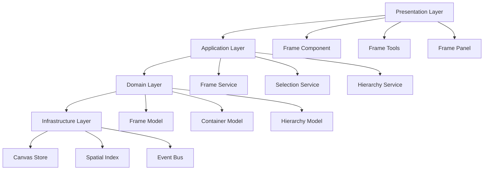

# Frame Feature Architecture Design Document

## Executive Summary

This document outlines the architectural design for implementing a Frame feature in MyBoard, transforming it from a flat layer system to a hierarchical organizational tool. The design follows SOLID principles and emphasizes simplicity while enabling future extensibility.

## Table of Contents

1. [Current System Analysis](#1-current-system-analysis)
2. [Goals & Requirements](#2-goals--requirements)
3. [Gap Analysis](#3-gap-analysis)
4. [Market Analysis](#4-market-analysis)
5. [Design Principles](#5-design-principles)
6. [Technical Architecture](#6-technical-architecture)
7. [Implementation Plan](#7-implementation-plan)

## 1. Current System Analysis

### 1.1 Architecture Overview

MyBoard currently implements a **flat layer system**:

```typescript
// Current flat structure
interface CanvasStore {
  layers: Map<string, Layer>  // All layers at same level
  layerIds: string[]          // Simple z-index ordering
}
```

### 1.2 Strengths

1. **Simplicity**: Easy to understand and maintain
2. **Performance**: Good for small to medium boards
3. **Type Safety**: Strong TypeScript types throughout
4. **State Management**: Clean Zustand implementation with history

### 1.3 Limitations

1. **No Hierarchy**: Cannot group or organize elements
2. **No Containment**: Elements cannot be bounded within areas
3. **Limited Organization**: Difficult to manage complex boards
4. **Scalability**: Performance degrades with many elements

## 2. Goals & Requirements

### 2.1 Primary Goals

1. **Add Organizational Structure**: Enable users to group related content
2. **Maintain Simplicity**: Follow KISS principle - start with MVP
3. **Ensure Performance**: No degradation for existing use cases
4. **Enable Future Growth**: Architecture that can evolve

### 2.2 Core Requirements

#### Must Have (Phase 1)
- Create frame containers with visual boundaries
- Move frames with their contents
- Add/remove elements from frames
- Frame selection and basic operations

#### Should Have (Phase 2)
- Frame navigation panel
- Resize frames
- Frame properties (name, color)
- Export frames individually

#### Could Have (Future)
- Nested frames
- Frame templates
- Auto-layout within frames
- Frame animations

### 2.3 Non-Functional Requirements

- **Performance**: <16ms render time for 1000 elements
- **Memory**: <100MB for typical board
- **Compatibility**: No breaking changes to existing boards
- **Accessibility**: Keyboard navigation for frames

## 3. Gap Analysis

### 3.1 Missing Components

| Component | Current State | Required State | Gap |
|-----------|--------------|----------------|-----|
| **Data Model** | Flat layers | Hierarchical structure | Need parent-child relationships |
| **State Management** | Single-level operations | Hierarchical operations | Need tree traversal |
| **Rendering** | Direct layer render | Nested rendering | Need clipping/transforms |
| **Selection** | Flat multi-select | Container-aware selection | Need selection modes |
| **Events** | Direct handling | Event bubbling | Need propagation |

### 3.2 Technical Debt to Address

1. **Canvas.tsx Complexity**: 600+ lines handling multiple responsibilities
2. **Tight Coupling**: Layer types hardcoded in multiple places
3. **No Extension Points**: Adding features requires modifying core

## 4. Market Analysis

### 4.1 Competitive Analysis

| Feature | Miro | FigJam | Excalidraw | MyBoard Goal |
|---------|------|---------|------------|--------------|
| **Frame Type** | Container | True Parent-Child | Groups | Hybrid Container |
| **Nesting** | No | Yes | No | Future (YAGNI) |
| **Performance** | Medium | High | High | High |
| **Complexity** | High | Medium | Low | Low (KISS) |
| **Selection** | Complex | Intuitive | Simple | Simple + Powerful |

### 4.2 Key Insights

1. **Miro**: Frames break with layers - avoid this design flaw
2. **FigJam**: True hierarchy works well but adds complexity
3. **Excalidraw**: Simple groups are limited but performant
4. **Our Approach**: Start simple, enable complexity later

## 5. Design Principles

### 5.1 SOLID Principles Application

#### Single Responsibility Principle (SRP)

```typescript
// Bad: Current Canvas.tsx does everything
// Good: Separate concerns

interface IFrameManager {
  createFrame(bounds: XYWH): string
  deleteFrame(id: string): void
}

interface IFrameRenderer {
  render(frame: Frame): ReactElement
}

interface IFrameEventHandler {
  handleSelect(id: string): void
  handleResize(id: string, bounds: XYWH): void
}
```

#### Open/Closed Principle (OCP)

```typescript
// Extensible layer system
interface ILayerHandler {
  canHandle(type: LayerType): boolean
  render(layer: Layer): ReactElement
  getBounds(layer: Layer): XYWH
}

// Register new types without modifying existing code
class LayerRegistry {
  private handlers = new Map<LayerType, ILayerHandler>()
  
  register(type: LayerType, handler: ILayerHandler): void {
    this.handlers.set(type, handler)
  }
}
```

#### Dependency Inversion Principle (DIP)

```typescript
// Depend on abstractions
interface IFrameService {
  createFrame(options: FrameOptions): Promise<Frame>
  updateFrame(id: string, updates: Partial<Frame>): Promise<Frame>
}

// Inject dependencies
class FrameComponent {
  constructor(private frameService: IFrameService) {}
}
```

### 5.2 Additional Principles

#### KISS (Keep It Simple)

```typescript
// Phase 1: Simple frame
interface SimpleFrame {
  id: string
  bounds: XYWH
  childIds: string[]  // Just track IDs, no complex nesting
}

// Avoid premature optimization
// No nested frames, no complex layouts, no animations
```

#### YAGNI (You Aren't Gonna Need It)

```typescript
// Don't implement:
// - Nested frames (until proven need)
// - Complex frame styles
// - Auto-layout algorithms
// - Frame templates

// Do implement:
// - Basic containment
// - Visual boundaries
// - Simple operations
```

#### DRY (Don't Repeat Yourself)

```typescript
// Reusable container behavior
abstract class Container<T> {
  protected children = new Set<string>()
  
  add(childId: string): void {
    this.children.add(childId)
  }
  
  remove(childId: string): void {
    this.children.delete(childId)
  }
}

// Frame reuses container logic
class Frame extends Container<Layer> {}
```

#### Law of Demeter

```typescript
// Bad: Deep coupling
const color = canvas.frames.get(id).children[0].layer.fill

// Good: Encapsulated access
const color = frameService.getChildColor(frameId, 0)
```

#### Dependency Injection

```typescript
// Constructor injection
class FrameManager {
  constructor(
    private store: ICanvasStore,
    private renderer: IFrameRenderer,
    private events: IEventBus
  ) {}
}

// Factory pattern
const createFrameManager = (deps: Dependencies) => {
  return new FrameManager(deps.store, deps.renderer, deps.events)
}
```

## 6. Technical Architecture

### 6.1 High-Level Design



### 6.2 Core Models

#### 6.2.1 Frame Model

```typescript
// Core frame interface - KISS principle
interface Frame {
  id: string
  type: 'frame'
  
  // Position & Size
  x: number
  y: number
  width: number
  height: number
  
  // Simple hierarchy - no nesting initially
  childIds: string[]
  
  // Visual properties
  strokeColor?: Color
  strokeWidth?: number
  backgroundColor?: Color
  
  // Metadata
  name?: string
  locked?: boolean
}
```

#### 6.2.2 Hierarchy Model

```typescript
// Simple parent-child tracking
interface IHierarchy {
  // Core operations
  addChild(parentId: string, childId: string): void
  removeChild(parentId: string, childId: string): void
  getChildren(parentId: string): string[]
  getParent(childId: string): string | null
  
  // Batch operations
  moveChildren(fromId: string, toId: string): void
}

// Implementation with validation
class FrameHierarchy implements IHierarchy {
  private parentMap = new Map<string, string>()
  private childrenMap = new Map<string, Set<string>>()
  
  addChild(parentId: string, childId: string): void {
    // Prevent circular references
    if (this.wouldCreateCycle(parentId, childId)) {
      throw new Error('Cannot create circular reference')
    }
    
    // Remove from previous parent
    const oldParent = this.parentMap.get(childId)
    if (oldParent) {
      this.childrenMap.get(oldParent)?.delete(childId)
    }
    
    // Add to new parent
    this.parentMap.set(childId, parentId)
    if (!this.childrenMap.has(parentId)) {
      this.childrenMap.set(parentId, new Set())
    }
    this.childrenMap.get(parentId)!.add(childId)
  }
}
```

### 6.3 State Management

#### 6.3.1 Enhanced Store Interface

```typescript
interface IFrameStore {
  // Frame operations
  createFrame(bounds: XYWH): string
  updateFrame(id: string, updates: Partial<Frame>): void
  deleteFrame(id: string): void
  
  // Hierarchy operations
  addToFrame(elementId: string, frameId: string): void
  removeFromFrame(elementId: string): void
  
  // Batch operations
  moveFrameWithChildren(frameId: string, delta: Point): void
}

// Implementation with Zustand
const useFrameStore = create<IFrameStore>((set, get) => ({
  frames: new Map<string, Frame>(),
  hierarchy: new FrameHierarchy(),
  
  createFrame: (bounds) => {
    const id = nanoid()
    const frame: Frame = {
      id,
      type: 'frame',
      ...bounds,
      childIds: []
    }
    
    set(state => {
      state.frames.set(id, frame)
    })
    
    return id
  },
  
  moveFrameWithChildren: (frameId, delta) => {
    const frame = get().frames.get(frameId)
    if (!frame) return
    
    // Use transaction for atomic update
    set(state => {
      // Move frame
      const updatedFrame = {
        ...frame,
        x: frame.x + delta.x,
        y: frame.y + delta.y
      }
      state.frames.set(frameId, updatedFrame)
      
      // Move children
      frame.childIds.forEach(childId => {
        const child = state.layers.get(childId)
        if (child) {
          state.layers.set(childId, {
            ...child,
            x: child.x + delta.x,
            y: child.y + delta.y
          })
        }
      })
    })
  }
}))
```

### 6.4 Component Architecture

#### 6.4.1 Frame Component

```typescript
interface IFrameProps {
  frame: Frame
  isSelected: boolean
  onSelect: (id: string) => void
  children: React.ReactNode
}

// Clean component with single responsibility
export const Frame: React.FC<IFrameProps> = memo(({
  frame,
  isSelected,
  onSelect,
  children
}) => {
  const handlePointerDown = useCallback((e: React.PointerEvent) => {
    e.stopPropagation()
    onSelect(frame.id)
  }, [frame.id, onSelect])
  
  return (
    <g transform={`translate(${frame.x}, ${frame.y})`}>
      {/* Frame border */}
      <rect
        width={frame.width}
        height={frame.height}
        fill={frame.backgroundColor || 'transparent'}
        stroke={frame.strokeColor || '#ccc'}
        strokeWidth={isSelected ? 2 : 1}
        onPointerDown={handlePointerDown}
      />
      
      {/* Frame label */}
      {frame.name && (
        <text x={4} y={-4} fontSize={12} fill="#666">
          {frame.name}
        </text>
      )}
      
      {/* Frame contents */}
      {children}
    </g>
  )
})
```

#### 6.4.2 Frame Service

```typescript
// Service interface for dependency injection
interface IFrameService {
  createFrame(options: CreateFrameOptions): Frame
  updateFrame(id: string, updates: FrameUpdate): Frame
  deleteFrame(id: string): void
  
  // Queries
  getFramesInBounds(bounds: XYWH): Frame[]
  getFrameAt(point: Point): Frame | null
}

// Implementation with injected dependencies
class FrameService implements IFrameService {
  constructor(
    private store: IFrameStore,
    private spatialIndex: ISpatialIndex,
    private eventBus: IEventBus
  ) {}
  
  createFrame(options: CreateFrameOptions): Frame {
    const frame = {
      id: nanoid(),
      type: 'frame' as const,
      ...options.bounds,
      childIds: [],
      name: options.name
    }
    
    this.store.createFrame(frame)
    this.spatialIndex.insert(frame.id, frame)
    this.eventBus.emit('frame:created', { frameId: frame.id })
    
    return frame
  }
}
```

### 6.5 Performance Optimizations

#### 6.5.1 Spatial Indexing

```typescript
// Simple spatial index for hit testing
interface ISpatialIndex {
  insert(id: string, bounds: XYWH): void
  remove(id: string): void
  query(area: XYWH): string[]
  queryPoint(point: Point): string[]
}

// Basic implementation - can upgrade to R-tree later
class SimpleSpatialIndex implements ISpatialIndex {
  private entries = new Map<string, XYWH>()
  
  insert(id: string, bounds: XYWH): void {
    this.entries.set(id, bounds)
  }
  
  query(area: XYWH): string[] {
    const results: string[] = []
    this.entries.forEach((bounds, id) => {
      if (this.intersects(bounds, area)) {
        results.push(id)
      }
    })
    return results
  }
  
  private intersects(a: XYWH, b: XYWH): boolean {
    return !(
      a.x + a.width < b.x ||
      b.x + b.width < a.x ||
      a.y + a.height < b.y ||
      b.y + b.height < a.y
    )
  }
}
```

#### 6.5.2 Render Optimization

```typescript
// Memoized frame renderer
const FrameRenderer = memo(({ frameId }: { frameId: string }) => {
  const frame = useFrameStore(state => state.frames.get(frameId))
  const childIds = frame?.childIds || []
  
  if (!frame) return null
  
  return (
    <Frame frame={frame} isSelected={false} onSelect={() => {}}>
      {childIds.map(childId => (
        <LayerPreview key={childId} id={childId} />
      ))}
    </Frame>
  )
}, (prev, next) => prev.frameId === next.frameId)
```

## 7. Implementation Plan

### 7.1 Phase 1: Foundation (Week 1)

**Goal**: Basic frame creation and rendering

**Tasks**:
1. Add Frame type to layer system
2. Create Frame component
3. Add frame tool to toolbar
4. Implement basic frame creation
5. Update rendering pipeline

**Deliverables**:
- Users can create frames
- Frames render as visual containers
- Basic frame selection

### 7.2 Phase 2: Containment (Week 2)

**Goal**: Parent-child relationships

**Tasks**:
1. Implement FrameHierarchy class
2. Add drag-to-frame functionality
3. Move frame with children
4. Update selection system
5. Add visual feedback

**Deliverables**:
- Drag layers into frames
- Move frames with contents
- Visual drop indicators

### 7.3 Phase 3: UI & Tools (Week 3)

**Goal**: Frame management UI

**Tasks**:
1. Create frame panel
2. Add frame properties
3. Implement resize handles
4. Add frame navigation
5. Create frame context menu

**Deliverables**:
- Frame management panel
- Resize and rename frames
- Quick frame navigation

### 7.4 Phase 4: Polish & Performance (Week 4)

**Goal**: Production-ready feature

**Tasks**:
1. Add spatial indexing
2. Optimize render performance
3. Add keyboard shortcuts
4. Implement frame export
5. Add comprehensive tests

**Deliverables**:
- Smooth performance
- Complete test coverage
- Export frames as images

### 7.5 Success Metrics

1. **Performance**: <16ms frame time with 1000 elements
2. **Usability**: 80% task completion rate in user testing
3. **Quality**: >90% test coverage
4. **Adoption**: 50% of users create frames in first week

## Conclusion

This architecture provides a solid foundation for implementing frames in MyBoard while adhering to clean code principles. By starting simple and building incrementally, we minimize risk while delivering value quickly. The design enables future enhancements without requiring significant refactoring.

Key principles followed:
- **SOLID**: Clean interfaces and dependency injection
- **KISS**: Start with simple containment
- **YAGNI**: No premature features
- **DRY**: Reusable abstractions
- **Law of Demeter**: Encapsulated access
- **Dependency Injection**: Testable and flexible

This approach ensures we build a maintainable, performant, and user-friendly frame system that can grow with our users' needs.